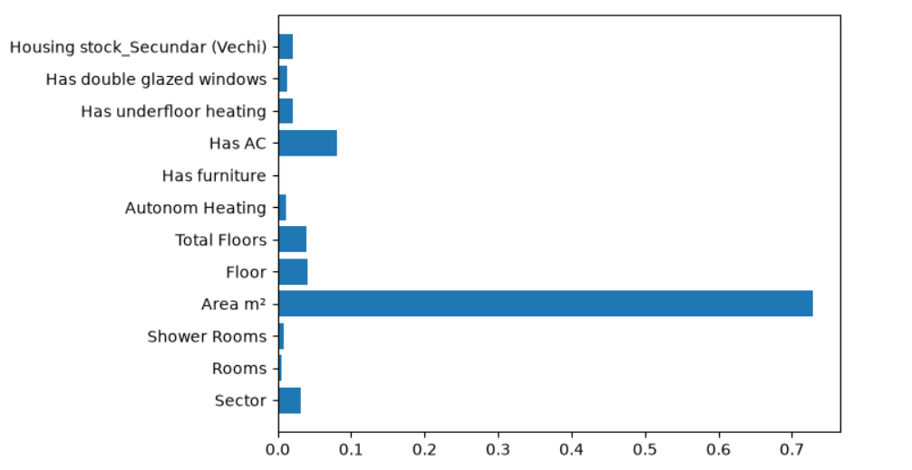

# Real Estate Analysis: Chisinau Apartments

Demonstrates an end-to-end workflow: scraping, cleaning,  EDA, ML modeling, business interpretation

## Project Overview

Scraped 1043 apartment listings from [immobiliare.md](https://immobiliare.md), cleaned and analyzed the data to answer 4 key business questions:

1. **Which sector is most stable?** -  Ciocana 
2. **Which feature adds most value?** - Area
3. **Is price linear with area?**  -  Linear up to ~120m², with a discount for extra-large units 
4. **How much does sector influence price vs area?** -  Area is ~6.9 more influential than sector on price 

## Model Performance
| Model | Avg R² (CV) | MAE (thousands €) |
|---|---|---|
| Linear Regression | 0.744 | 22.2 |
| Random Forest | 0.754 | 23.17 |




## Methodology

- **Data**: from 1043 raw listings to 450 cleaned apartments (outliers removed via IQR, invalid entries dropped)
- **Features**: sector, rooms, area, floor, heating, amenities (AC, underfloor heating, furniture, double glazing)

## Files

- `scraper/scraper.py` - Web scraper 
- `scraper/load_to_sql.py` - Creating slite3 database
- `notebooks/Real Estate Analysis.ipynb` - Full EDA + modeling pipeline
- `sql/queries` - SQL queries

## How to Run

1. **Install dependencies and playwright:**
```bash
   pip install -r requirements.txt
   playwright install chromium
```

2. **(Optional) Run the scraper:**
```bash
   python scraper/scraper.py
```
Choose S (sales) or R (rent) when prompted
Output: `Real_estate_data.xlsx` in data folder

3. **Load to sql:**
```bash
   python scraper/load_to_sql.py
```

4. **Run the analysis:**
```bash
   jupyter notebook "notebooks/Real Estate Analysis.ipynb"
```

`load_to_sql.py` loads the scraped data into SQLite and creates the `apartments` view used by the notebook.
Queries used in the analysis are in `sql/queries/` (includes a window-function query, aggregates etc.).

## Tech Stack

- **Scraping**: BeautifulSoup / Playwright / requests, openpyxl for saving in Excel
- **Analysis**: pandas, numpy, matplotlib, seaborn
- **ML**: scikit-learn (Linear Regression, Random Forest)
- **Database**: sqlite, SQL (window functions, views)
## Future Work

- Expand data 
- Add geolocation features (distance to Metro, schools, parks)

## Author

Tarnavski Stanislav

---

